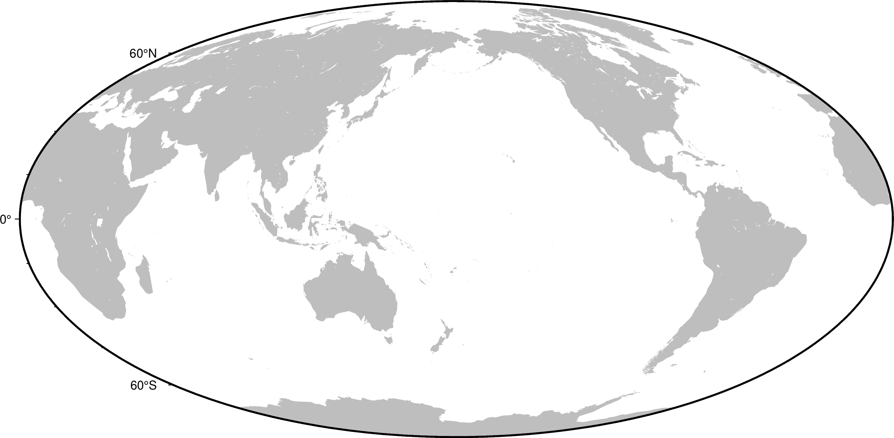

---
jupytext:
  cell_metadata_filter: -all
  formats: md:myst
  text_representation:
    extension: .md
    format_name: myst
    format_version: 0.13
    jupytext_version: 1.11.5
kernelspec:
  display_name: Python 3
  language: python
  name: python3
---

# About


```{code-cell}
%%bash
gmt begin globe jpg
gmt coast -Rg -JW10i -Baf -Gred
gmt end
echo "meh"
```


